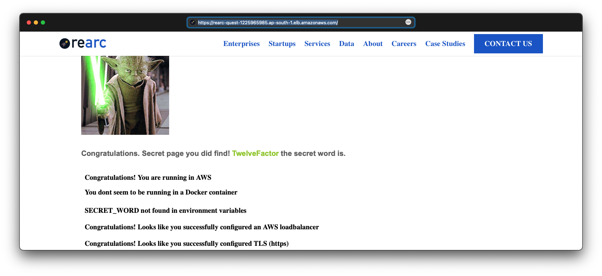

This repo was forked from https://github.com/rearc/quest & contains the solution to the tasks described there.

---

Here are the links to the LIVE app:

(Instead of merging all tasks into one setup, I have created them separately, so each URL below satisfies some of the requirements, not all.)

NOTE: The infra supporting these will be torn down on August 25, 2021!

UPDATES [August 25, 2021]:
- The following links are no longer live. The infra hosting them has been destroyed!
- GitHub Actions have been disabled for this repo to avoid redeployment of the AWS resources.

---

- http://15.206.80.13:3000/ — Node.js app (Express.js server) running as a systemd service in a 64-bit Amazon Linux 2 EC2 instance. No Docker. No secret word. No load balancer. No TLS.

- http://15.206.80.13:3030/ — Node.js app (Express.js server) running as a Docker container in a 64-bit Amazon Linux 2 EC2 instance with secret word "TwelveFactor". No load balancer. No TLS.

- https://rearc-quest-1949308220.ap-south-1.elb.amazonaws.com/ — Node.js app (Express.js server) running as a systemd service in a 64-bit Amazon Linux 2 EC2 instance, fronted by an AWS Application load balancer with TLS. No Docker. No secret word.

---

---

When you push a change to this repo, the following happens:

1. Two GitHub Actions workflows are triggered: one for Docker & another for Terraform.

2. The Docker workflow:

   2.1. Logs into my Docker Hub account using a secret token.

   2.2. Builds a Docker image from `app/Dockerfile`.

   2.3. Pushes this Docker image to my Docker Hub repo.

3. The Terraform workflow:

   3.1. Connects to a Terraform workspace in Terraform Cloud.

   3.2. Runs Terraform `init` & `apply`.

---

Variables in Terraform workspace:

---

More fun facts about this project:

- `app/rearc.service` is the systemd service unit file for a service which ensures that the Node.js app (Express.js server) is always running. This service will auto-restart the app if it dies due to an exception.

- The app is deployed to the EC2 instance by a standalone Terraform provisioner (inside a null resource).

- The SSH key pair for the EC2 instance is generated by a Terraform script. It also saves the private key into Secrets Manager!

- The TLS certificate for the AWS ALB is generated by Terraform & imported into ACM. It is self-signed & valid for all `*.AWS_REGION.elb.amazonaws.com` domains.

---

---

---

README of the original repo follows:

---

# A quest in the clouds

### Q. What is this quest?

It is a fun way to assess your cloud skills. It is also a good representative sample of the work we do at Rearc. Quest is a webapp made with node.js and golang.

### Q. Do I need to be an expert in node.js and golang?

No. The starting point of the quest app is `npm install && npm start`. That is all the node.js you need to know. And you wont even see golang.

### Q. So what skills should I have?

AWS. General cloud concepts, especially networking. Docker (containerization). IaC (Infrastructure as code). Linux/Unix. Git. TLS certs is a plus.

### Q. What do I have to do?

You may do all or some of the following tasks. Please read over the complete list before starting.

1. If you know how to use git, start a git repository (local-only is acceptable) and commit all of your work to it.
2. Deploy the app in AWS and navigate to the index page. Use Linux 64-bit as your OS (Amazon Linux preferred).
3. Deploy the app in a Docker container. Use `node:10` as the base image.
4. Inject an environment variable (`SECRET_WORD`) in the Docker container. The value of `SECRET_WORD` should be the secret word discovered on the index page of the application.
5. Deploy a load balancer in front of the app.
6. Use Infrastructure as Code (IaC) to "codify" your deployment. Terraform is ideal, but use whatever you know, e.g. CloudFormation, CDK, Deployment Manager, etc.
7. Add TLS (https). You may use locally-generated certs.

### Q. How do I know I have solved these stages?

Each stage can be tested as follows (where `<ip_or_host>` is the location where the app is deployed):

1. Index page (contains the secret word) - `http(s)://<ip_or_host>[:port]/`
2. Docker check - `http(s)://<ip_or_host>[:port]/docker`
3. Secret Word check - `http(s)://<ip_or_host>[:port]/secret_word`
4. Load Balancer check - `http(s)://<ip_or_host>[:port]/loadbalanced`
5. TLS check - `http(s)://<ip_or_host>[:port]/tls`

### Q. Do I have to do all these?

You may do whichever, and however many, of the tasks above as you'd like. We suspect that once you start, you won't be able to stop. It's addictive.

### Q. What do I have to submit?

1. Your work assets, as one or both of the following:

- A link to a hosted git repository.
- A ZIP file containing your project directory. Include the `.git` sub-directory if you used git.

2. Proof of completion, as one or both of the following:

- A link to a hosted AWS deployment.
- One or more screenshots showing, at least, the index page of the final deployment.

Your work assets should include:

- IaC files, if you completed that task.
- One or more Dockerfiles, if you completed that task.
- A sensible README or other file(s) that contain instructions, notes, or other written documentation to help us review and assess your submission.

### Q. How long do I need to host my submission on AWS?

You don't have to at all if you don't want to. You can run it in AWS, grab a screenshot, then tear it all down to avoid costs.

If you _want_ to host it longer for us to view it, we recommend taking a screenshot anyway and sending that along with the link. Then you can tear down the quest whenever you want and we'll still have the screenshot. We recommend waiting no longer than one week after sending us the link before tearing it down.

### Q. What if I successfully complete all the challenges?

We have many more for you to solve as a member of the Rearc team!

### Q. What if I find a bug?

Awesome! Tell us you found a bug in your submission to us, ideally in an email, and we'll talk more!

### Q. What if I fail?

There is no fail. Complete whatever you can and then submit your work. Doing _everything_ in the quest is not a guarantee that you will "pass" the quest, just like not doing something is not a guarantee you will "fail" the quest.

### Q. Can I share this quest with others?

No.
